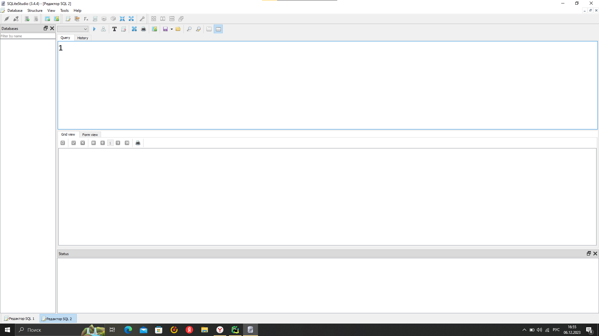
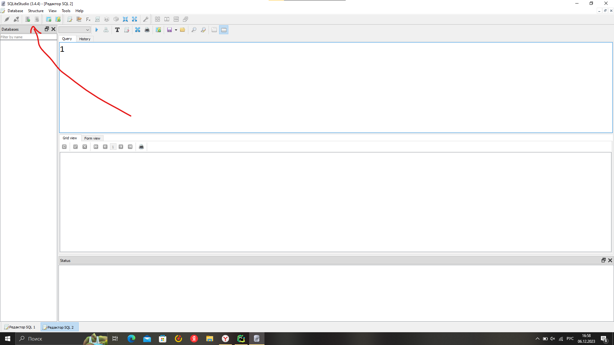
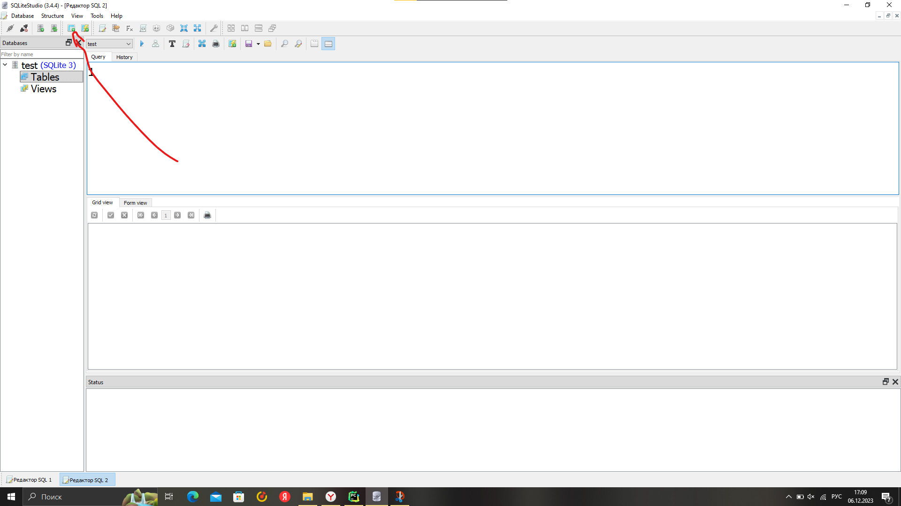

# Занятие 3

## Введение

На прошлом занятии мы познакомились с базами данных. Мы не успели толком в них разобраться, поэтому продолжим сегодня. Мы научились подключаться к базе данных и выбирать из неё элементы. *Напомню, для этого использовался `SELECT`*.

Сегодня мы познакомимся с созданием и редактированием баз данных при помощи сторонних приложений, а также изучим запросы на добавление, изменение и удаление.

## Редактор для работы с sqlite

Существует довольно много различных редакторов для БД (даже от JetBrains есть **DataGrip**). Мы же для начала будем использовать [Sqlite Studio](https://sqlitestudio.pl). Это бесплатный редактор для sqlite баз данных. Профессиональная версия PyCharm так же умеет работать с БД, но удобнее для этого использовать специализированные программы. C установкой, я уверен, вы справитесь (если у вас не мак).



Интерфейс приложения выглядит примерно следующим образом. Чтобы создать БД, нужно нажать на выделенную на картинке ниже кнопку.



В появившемся окне необходимо выбрать куда и с каким именем будет сохранён файл с вашей БД. Удобнее всего сразу выбирать то место, где у вас лежит проект - так будет проще с ней работать. ***Имя файла нужно указывать с расширением `.db`***.

Теперь созданная база данных открыта и прикреплена к редактору. Напомню, что чтобы работать с sqlite в python, нужно подключаться к ней. Для этого мы использовали connect. Здесь мы работаем очень похожим образом. Сейчас мы подключены к бд, но можем и отключиться. Сейчас в нашей базе нет ни одной таблицы. Давайте создадим парочку. Для этого нужно нажать на выделенную на картинке ниже кнопку.



Перед вами появится интерфейс для создания колонок таблицы. Тут, так же как и в drawsql, нужно указывать имя колонки и тип данных, а также некоторые параметры этих колонок. С этим мы подробнее разберёмся на практике. После создания таблицы можно перейти в раздел данных **Data**. Там можно будет изменять те данные, которые хранятся в вашей таблице. Интерфейс довольно понятный, попробуйте разобраться самостоятельно.

## Запросы к БД

Для того, чтобы сделать запрос на получение данных, мы использовали `SELECT`. Сегодня же мы научимся использовать и другие запросы. К примеру, запрос на добавление данных:

```sql
INSERT INTO имя_таблицы[имена столбцов, в которые будем подставлять данные] 
       VALUES (значения)
```

А также запрос на обновление данных:

```sql
UPDATE имя_таблицы SET имя_столбца=значение WHERE условие
```

Синтаксис запроса на удаление выглядит так же, как и SELECT-запрос:

```sql
DELETE FROM имя_таблицы WHERE условие
```

Теперь вернёмся к тому, как делать эти самые запросы при помощи Python.

На прошлом занятии мы познакомились с тем, как подключаться к БД, но не более. Рассмотрим пример:

```python
from sqlite import connect

con = connect("test.db")  # Подключаемся к БД
cur = con.cursor()  # Получаем курсор (с помощью него мы и будем делать запросы)

res = cur.execute("""SELECT * FROM orders""").fetchall()  # Делаем запрос, а потом получаем все результаты
```

Помимо `.fetchall()` существуют ещё `.fetchone()` и `.fetchmany(n)`. Думаю, по названиям понятно, для чего они предназначены.

## Задание на сегодня

Вернёмся к [заданию](/Lesson1-2/task.md) с предыдущего занятия. Там нам было нужно написать приложение для заказа пиццы. Давайте перепишем его с использованием баз данных.
