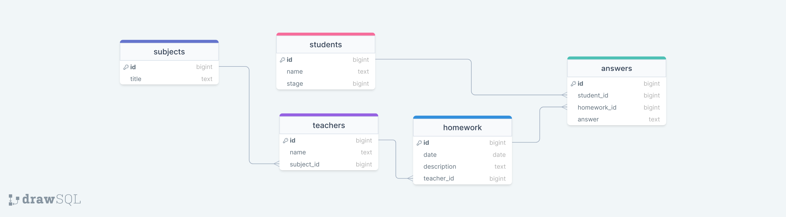

# Работа с SQLAlchemy

## Инициализация

Перед началом работы с SQLAlchemy, необходимо инициализировать базу данных. Это делается с помощью функции `init()` из файла `database.py`.

```python
from data import database

database.init()
```

## Создание своих моделей

### Первая модель

Создание моделей в SQLAlchemy включает в себя определение классов, которые наследуются от базового класса `Base`, предоставляемого SQLAlchemy. Каждый такой класс представляет собой таблицу в базе данных.

Вот пример создания модели `Item`:

```python
from sqlalchemy import Column, ForeignKey
from sqlalchemy.dialects.sqlite import TEXT, INTEGER
from sqlalchemy.orm import relationship

from .database import Base

class Item(Base):
    __tablename__ = 'items'

    def __init__(self, title, price):
        super().__init__()
        self.title = title
        self.price = price

    id = Column(INTEGER, primary_key=True)
    title = Column(TEXT, unique=True)
    price = Column(INTEGER, nullable=False)

    orders = relationship("Order", secondary="orders_to_items",
                          backref="orders",
                          lazy="subquery")

    def __repr__(self):
        return f"Item('{self.title}')"
```

В этом примере:

- `__tablename__` - это имя таблицы в базе данных.
- `id`, `title` и `price` - это столбцы таблицы. Они определяются как экземпляры класса `Column`, которые принимают тип данных в качестве аргумента.
- `orders` - это отношение между `Item` и `Order`. Оно определяется с помощью функции `relationship()`, которая принимает имя другого класса модели и дополнительные аргументы, определяющие свойства отношения.
- `__repr__` - это специальный метод, который возвращает строковое представление экземпляра класса.

### Работа с отношениями

Функция `relationship()` в SQLAlchemy используется для определения отношений между моделями. Она позволяет установить связи между таблицами в базе данных и обеспечивает удобный интерфейс для работы с этими связями в коде.

Вот пример использования `relationship()` в модели `Item`:

```python
orders = relationship("Order", secondary="orders_to_items",
                      backref="orders",
                      lazy="subquery")
```

В этом примере:

- `"Order"` - это имя класса модели, с которым устанавливается отношение.
- `secondary="orders_to_items"` - это имя вспомогательной таблицы, которая используется для установления многие-ко-многим отношения между `Item` и `Order`.
- `backref="orders"` - это имя обратной ссылки, которое можно использовать для доступа к экземплярам `Item` из экземпляра `Order`.
- `lazy="subquery"` - это стратегия загрузки, которая определяет, когда SQLAlchemy будет загружать данные из базы данных.

В результате этого определения, вы можете получить доступ к всем заказам, связанным с определенным товаром, используя атрибут `orders`:

```python
item = session.query(Item).first()
for order in item.orders:
    print(order.id)
```

Аналогично, вы можете получить доступ ко всем товарам в заказе, используя обратную ссылку `orders`:

```python
order = session.query(Order).first()
for item in order.orders:
    print(item.title)
```

Это основные принципы работы с функцией `relationship()` в SQLAlchemy. Для более сложных отношений и настроек рекомендуется обратиться к документации SQLAlchemy.

## Создание сессии

Для работы с базой данных, нам нужно создать сессию. Это делается с помощью функции `create_session()` из файла `database.py`.

```python
session = database.create_session()
```

## Добавление элементов

Для добавления новых элементов в базу данных, мы создаем экземпляры классов, определенных в файле `__all_models.py`, и добавляем их в сессию.

```python
from data.__all_models import Item, Order, OrderItem

# Создаем новый товар
new_item = Item(title="Новый товар", price=100)

# Добавляем товар в сессию
session.add(new_item)

# Сохраняем изменения
session.commit()
```

## Получение элементов

Для получения элементов из базы данных, мы используем метод `query()` сессии.

```python
# Получаем все товары
items = session.query(Item).all()

# Выводим названия и цены всех товаров
for item in items:
    print(f"Название: {item.title}, Цена: {item.price}")
```

## Обновление элементов

Для обновления элементов в базе данных, мы изменяем их свойства и вызываем метод `commit()` сессии.

```python
# Находим товар по названию
item_to_update = session.query(Item).filter(Item.title == "Новый товар").first()

# Изменяем цену товара
item_to_update.price = 200

# Сохраняем изменения
session.commit()
```

## Удаление элементов

Для удаления элементов из базы данных, мы используем метод `delete()` сессии.

```python
# Находим товар по названию
item_to_delete = session.query(Item).filter(Item.title == "Новый товар").first()

# Удаляем товар
session.delete(item_to_delete)

# Сохраняем изменения
session.commit()
```

Это основные операции, которые можно выполнять с SQLAlchemy. Для более сложных запросов и операций, рекомендуется обратиться к документации SQLAlchemy.

## Задание для самопроверки

Необходимо создать базу данных по схеме, изображённой на рисунке ниже:



Или по следующему описанию таблиц:

## Таблицы

### `subjects`


| Поле | Тип | Описание                                                                                                   |
| -------- | ------ | ------------------------------------------------------------------------------------------------------------------ |
| `id`     | BIGINT | Уникальный идентификатор предмета, является первичным ключом |
| `title`  | TEXT   | Название предмета                                                                                  |

### `students`


| Поле | Тип | Описание                                                                                                   |
| -------- | ------ | ------------------------------------------------------------------------------------------------------------------ |
| `id`     | BIGINT | Уникальный идентификатор студента, является первичным ключом |
| `name`   | TEXT   | Имя студента                                                                                            |
| `stage`  | BIGINT | Этап обучения студента                                                                         |

### `teachers`


| Поле     | Тип | Описание                                                                                                                                   |
| ------------ | ------ | -------------------------------------------------------------------------------------------------------------------------------------------------- |
| `id`         | BIGINT | Уникальный идентификатор учителя, является первичным ключом                                   |
| `name`       | TEXT   | Имя учителя                                                                                                                              |
| `subject_id` | BIGINT | Идентификатор предмета, который преподает учитель, внешний ключ к таблице`subjects` |

### `homework`


| Поле      | Тип | Описание                                                                                                                                          |
| ------------- | ------ | --------------------------------------------------------------------------------------------------------------------------------------------------------- |
| `id`          | BIGINT | Уникальный идентификатор домашнего задания, является первичным ключом                       |
| `date`        | DATE   | Дата выдачи домашнего задания                                                                                                   |
| `description` | TEXT   | Описание домашнего задания                                                                                                        |
| `teacher_id`  | BIGINT | Идентификатор учителя, который выдал домашнее задание, внешний ключ к таблице`teachers` |

### `answers`


| Поле      | Тип | Описание                                                                                                                                                |
| ------------- | ------ | --------------------------------------------------------------------------------------------------------------------------------------------------------------- |
| `id`          | BIGINT | Уникальный идентификатор ответа, является первичным ключом                                                  |
| `student_id`  | BIGINT | Идентификатор студента, который дал ответ, внешний ключ к таблице`students`                              |
| `homework_id` | BIGINT | Идентификатор домашнего задания, на которое был дан ответ, внешний ключ к таблице`homework` |
| `answer`      | TEXT   | Текст ответа                                                                                                                                         |

И добавить туда тестовые данные. Далее выполнить следующие запросы:

## Запросы

1. Получить всех студентов
2. Получить всех учителей, преподающих определённый предмет
3. Получить все домашние задания, выданные определённым учителем
4. Получить все ответы определённого студениа на домашнее задание
5. Добавить нового студента
6. Обновить имя учителя
7. Удалить домашнее задание (ура, домашки не будет)

## Подсказки
Для заполнения данных в базе данных, можно использовать код из файла `insertion.py`.